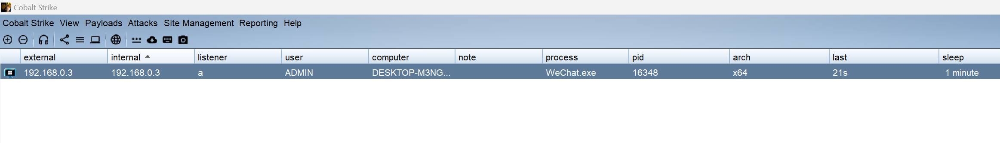
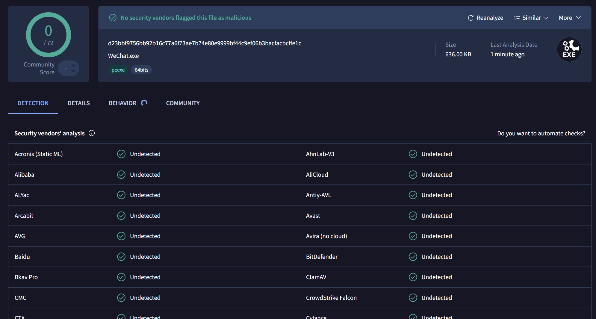
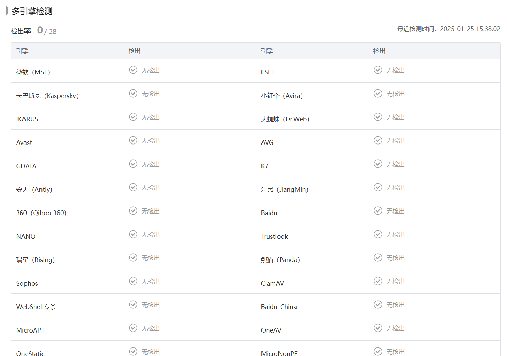

# cobalt-strike-stager-rewrite
rewrite cobalt strike stager shellcode to bypass AV/EDR

Patch the loader shellcode to the main function of wechat.exe and add the stager shellcode to the resources of wechat.exe. The loader decrypts the stager shellcode in the resources and executes it

https://www.virustotal.com/gui/file/d23bbf9756bb92b16c77a6f73ae7b74e80e9999bf44c9ef06b3bacfacbcffe1c

https://s.threatbook.com/report/file/d23bbf9756bb92b16c77a6f73ae7b74e80e9999bf44c9ef06b3bacfacbcffe1c

